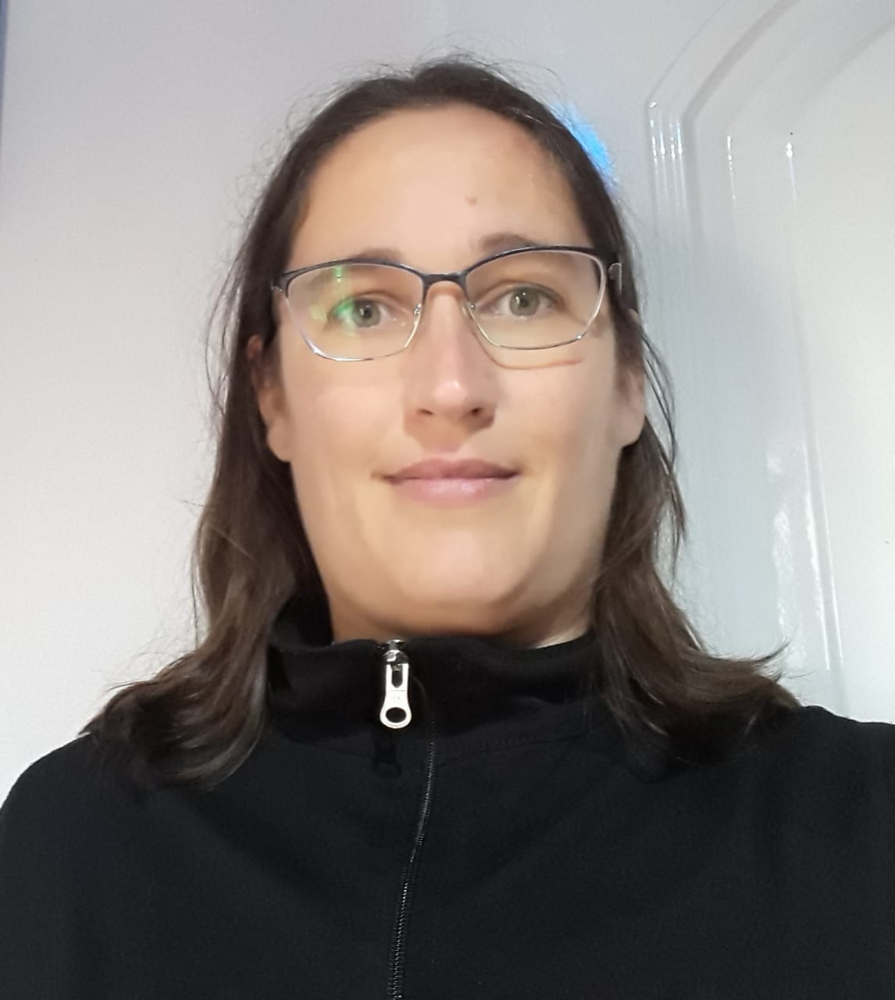

### Datos personales
- Nacida el 16/09/1980
- Lugar de nacimiento: Capitán Sarmiento
- Nacionalidad Argentina

### Formación académica

**Educación Universitaria Actual**
Técnica Universitaria en Programación Informática
Universidad de Quilmes
Año de egreso:2020
 
**Educación Universitaria**
Técnica Universitaria En Gestión de Empresas Agropecuarias.
Universidad Blas Pascal
Año de egreso: 2010

**Estudios universitarios no concluidos**
Licenciatura en Administración de Empresas
Universidad Nacional de Luján
Tel. 02323-423171
Intersección rutas 5 y 7.Luján. Bs.  As.

**Educación secundaria**
Bachiller en Gestión y Administración
Esc. Educación Media Nº 1 Dr. Mateo  Vicente Jelicich
Guido Lucotti 757
Tel. 02478-481768
Capitán Sarmiento (Bs. As.)

**Estudios Complementarios**
- Técnico en liquidación de sueldo y cargas sociales (IDIIP)
- Mandataria Nacional del registro del automotor y créditos prendarios
- Curso de Manipulación de alimentos (Centro de Formación profesional)
- Curso de Portugués, duracion 1 año (Centro de Formación profesional).

### Experiencia laboral:

- 2014 Empleada en Cablevisión Fibertel
 Desempeño: Repartidor
 Juan Manuel de Rosas 285
 Capitán Sarmiento

- 2007-2008 Farmacia Modelo de Giles	
 Desempeño: tareas administrativas		
 Moreno 620(San Andrés de Giles)
 Tel 02325-444209

- 2005-2007 Dueña en  Gestoría Integral ¨VG¨,
 Trámites del automotor, monotributo.
 9 de Julio s/n. San Andrés de Giles.
	
- 2004 Organización ¨Spalla¨
 Desempeño: Tareas Administrativas.
 Tomás Vallé s/n
 Cel: 02325-15-597028
 Carmen de Areco (Bs. As.)

- 2003- Fotocopiadora ¨La U de Luján ¨
 Atención al público
 Universidad de Luján
 Ruta 5 y 7. Luján.

- Pasantía Laboral: Silos Folguera S.A.
 Duración 3 meses
 Desempeño: Tareas Administrativas.
 Ruta Nº 8 Km. 144
 Tel. 02478-482661
 Capitán Sarmiento (Bs. As.)

### Conocimientos en: ###

<i class="devicon-android-plain-wordmark colored"></i>
<i class="devicon-github-plain-wordmark colored"></i>
<i class="devicon-gitlab-plain-wordmark colored"></i>
<i class="devicon-javascript-plain colored"></i>
<i class="devicon-mysql-plain-wordmark colored"></i>
<i class="devicon-tomcat-line-wordmark colored"></i>
<i class="devicon-bootstrap-plain-wordmark colored"></i>
<i class="devicon-linux-plain colored"></i>

## Contacto
valeriagrandi@ hotmail.com

